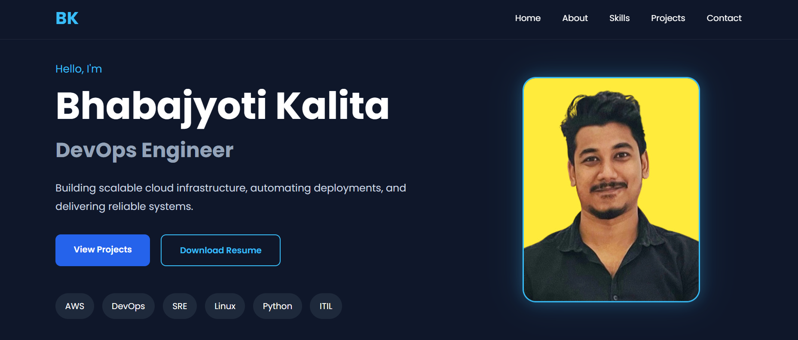

# 🚀 DevOps Portfolio Website

A modern and responsive portfolio website built using **Node.js**, **Express.js**, **EJS**, HTML, CSS, and JavaScript. The application follows the MVC architecture and is designed to showcase my professional experience, technical skills, projects, and contact information.

---

## 📸 Preview



---

## ✨ Features

- Responsive modern UI
- MVC architecture
- Hero section with profile image
- About Me section
- Technical Skills
- Professional Experience
- Featured Projects
- Contact Information
- Resume Download
- Smooth scrolling navigation
- Mobile responsive design

---

## 🛠️ Tech Stack

### Frontend

- HTML5
- CSS3
- JavaScript
- EJS
- Font Awesome

### Backend

- Node.js
- Express.js

### Deployment

- AWS EC2
- Git
- GitHub
- Linux

---

## 📂 Project Structure

```
portfolio-app/
├── controllers/
│   └── homeController.js
├── data/
│   └── portfolio.js
├── public/
│   ├── css/
│   ├── images/
│   ├── js/
│   └── resume.pdf
├── routes/
│   └── homeRoutes.js
├── views/
│   └── index.ejs
├── app.js
├── package.json
└── README.md
```

---

## 🚀 Installation

Clone the repository

```bash
git clone https://github.com/BhabajyotiKalita/portfolio-app.git
```

Go to the project directory

```bash
cd portfolio-app
```

Install dependencies

```bash
npm install
```

Start the application

```bash
npm start
```

The application will run at:

```
http://localhost:3000
```

---

## 📁 Project Sections

- Hero
- About
- Technical Skills
- Professional Experience
- Featured Projects
- Contact
- Resume Download

---

## 👨‍💻 Author

**Bhabajyoti Kalita**

- LinkedIn: https://linkedin.com/in/bhabajyotikalita
- GitHub: https://github.com/BhabajyotiKalita
- Email: bhabajyotikalita66@gmail.com

---
